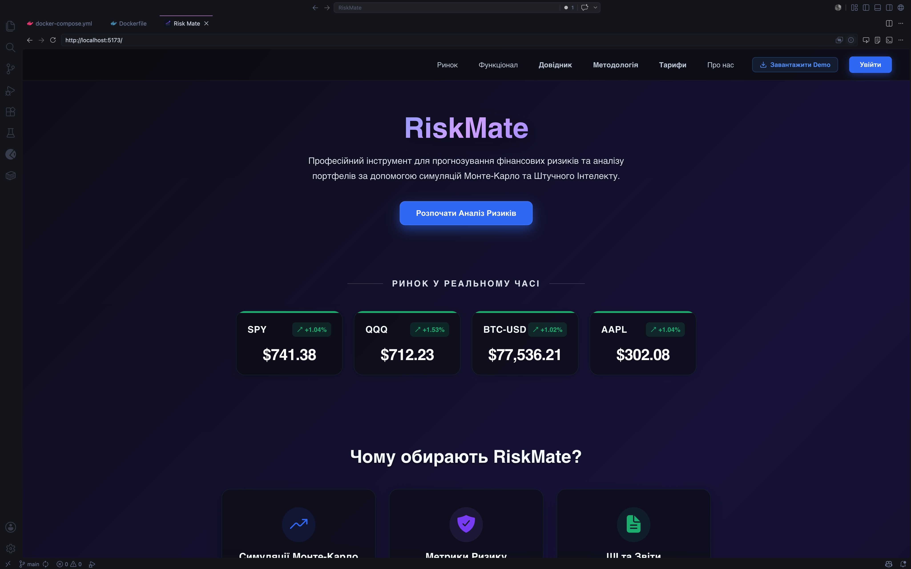
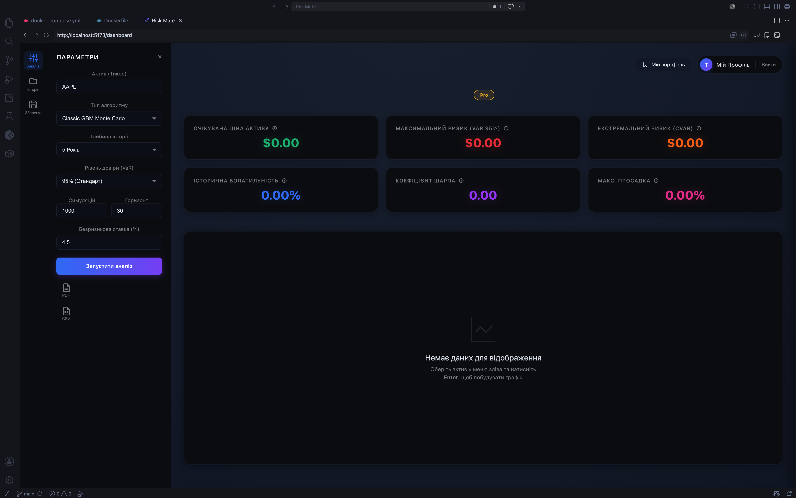
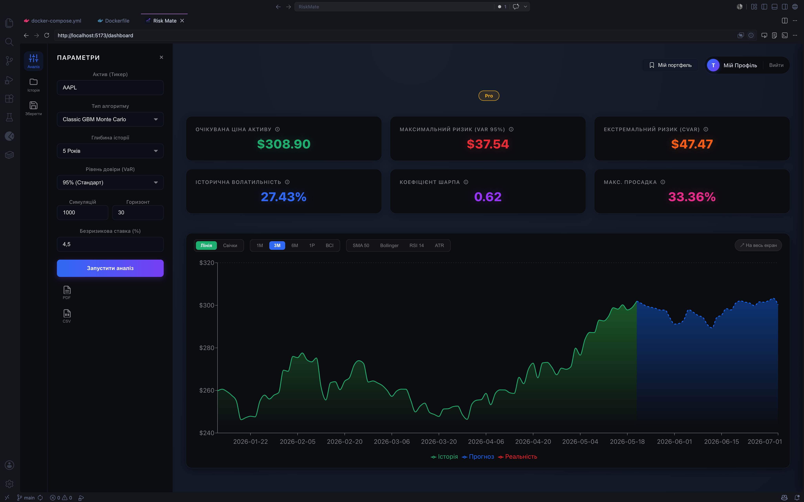
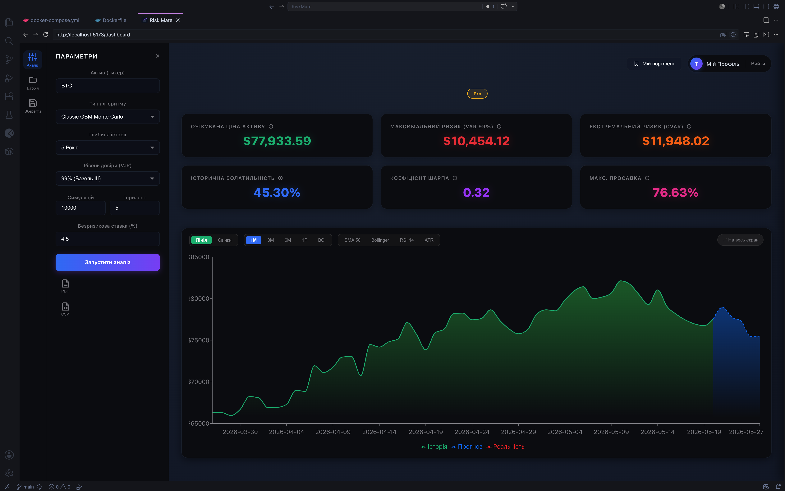
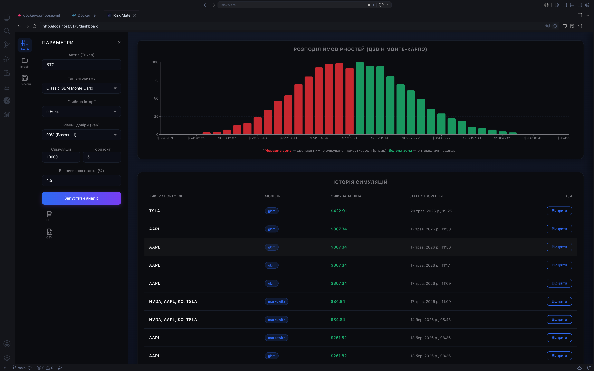
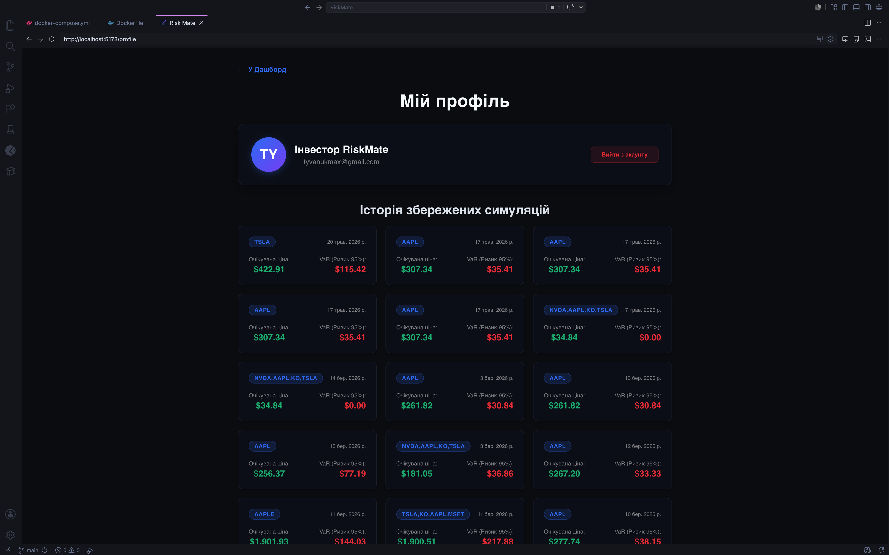

<div align="center">

# RiskMate

**Система прогнозування фінансових ризиків та оптимізації інвестиційних портфелів**

[](https://python.org)
[](https://fastapi.tiangolo.com)
[](https://react.dev)
[](https://tensorflow.org)
[](https://firebase.google.com)
[](https://stripe.com)

</div>

---

## Зміст

- [Про проєкт](#про-проєкт)
- [Функціонал](#функціонал)
- [Технічний стек](#технічний-стек)
- [Архітектура](#архітектура)
- [Встановлення та запуск](#встановлення-та-запуск)
- [API Reference](#api-reference)
- [Конфігурація](#конфігурація)
- [Скриншоти](#скриншоти)

---

## Про проєкт

RiskMate — комплексна веб-платформа, що поєднує **класичні мікроекономічні моделі** з **алгоритмами машинного навчання** для оцінки волатильності фінансових активів. Система підтримує аналіз як традиційних акцій, так і криптовалют, надаючи інвесторам інструменти для кількісної оцінки ризику та побудови оптимального портфеля.

Проєкт розроблено як інструмент для поглибленого вивчення фінансової інженерії та ризик-менеджменту.

---

## Функціонал

|Модуль                   |Тип  |Опис                                                                                                                                                                                                       |
|-------------------------|-----|-----------------------------------------------------------------------------------------------------------------------------------------------------------------------------------------------------------|
|**Симуляція Монте-Карло**|Core |Генерація тисяч цінових сценаріїв на основі геометричного броунівського руху (GBM). Моделює стохастичну динаміку активу з урахуванням дрейфу (μ) та волатильності (σ)                                      |
|**Історичне моделювання**|Core |Генерація сценаріїв на основі реальних історичних прибутковостей без параметричних припущень. Ресемплінг (bootstrap) з фактичних денних повернень — враховує реальні “стрибки” та аномалії ринку           |
|**VaR та CVaR**          |Risk |Розрахунок Value at Risk і Conditional Value at Risk з урахуванням “товстих хвостів” розподілу. Підтримує параметричний, історичний та Монте-Карло підходи на довільному рівні довіри                      |
|**Стрес-тестування**     |Risk |Оцінка поведінки портфеля в екстремальних умовах: криза 2008, COVID-crash 2020, Flash Crash та кастомні сценарії із заданими шоками. Розраховує просадку (drawdown) та відносні втрати під кожним сценарієм|
|**Бектестинг стратегій** |Risk |Перевірка точності VaR-моделі на реальних даних: підрахунок порушень (violations), Купієць-тест (Kupiec POF-test) та тест Крістоффєрсена. Виводить Sharpe ratio, max drawdown та hit rate                  |
|**LSTM-нейромережа**     |AI   |Аналіз часових рядів і прогнозування цін на базі TensorFlow/Keras. Навчання на ковзних вікнах, нормалізація через MinMaxScaler, підтримка мультикрокового прогнозу                                         |
|**Модель Марковіца**     |AI   |Оптимізація портфеля за критерієм Шарпа з побудовою ефективної межі (Efficient Frontier). Враховує кореляційну матрицю активів та обмеження на вагові частки                                               |
|**Інтерактивний дашборд**|UI   |Візуалізація даних у реальному часі: candlestick-графіки, розподіл симуляцій, ефективна межа, heatmap кореляцій. Адаптивний layout для мобільних та десктопних пристроїв                                   |
|**Аутентифікація**       |Infra|Firebase Auth з підтримкою Google OAuth, email/password входу та захищених маршрутів через JWT-токени на стороні FastAPI backend                                                                           |
|**Система підписок**     |Infra|Stripe Payments з обробкою вебхуків для активації тарифів та диференційованим доступом до функцій залежно від рівня плану (Free / Pro / Premium)                                                           |
---

## Технічний стек

### Backend
- **Python 3.12** + **FastAPI** — REST API сервер
- **Pandas, NumPy, SciPy** — математичне моделювання
- **TensorFlow** — LSTM-нейромережа для аналізу часових рядів
- **arch** — GARCH-моделі волатильності
- **yfinance** — отримання ринкових даних у реальному часі

### Frontend
- **React 18** + **Vite** — SPA-додаток
- **Recharts / Lightweight Charts** — фінансові графіки та візуалізація
- **Tailwind CSS** — стилізація інтерфейсу

### Інфраструктура
- **Firebase** — аутентифікація користувачів та хмарна база даних
- **Stripe** — обробка платежів та керування підписками

---

## Архітектура

```
riskmate-back/
├── main.py                 # Точка входу, реєстрація роутерів
├── routers/                # API-маршрути (simulation, portfolio, auth)
├── services/               # Бізнес-логіка (Monte Carlo, Markowitz, VaR)
├── models/                 # LSTM-модель, Pydantic-схеми
└── requirements.txt

riskmate-front/
├── src/
│   ├── pages/              # Dashboard, Simulation, Portfolio, Pricing
│   ├── components/         # Переиспользуемые UI-компоненти та графіки
│   └── services/           # API-клієнт, Firebase SDK
├── vite.config.js
└── tailwind.config.js
```

---

## Встановлення та запуск

### Передумови

- Python 3.12+
- Node.js 18+
- Stripe CLI (для локального тестування вебхуків)

### 1. Backend

```bash
cd riskmate-back
python3 -m venv venv
source venv/bin/activate       # Windows: venv\Scripts\activate
pip install -r requirements.txt
uvicorn main:app --reload
```

API буде доступне за адресою: `http://localhost:8000`  
Інтерактивна документація: `http://localhost:8000/docs`

### 2. Frontend

```bash
cd riskmate-front
npm install
npm run dev
```

Додаток буде доступний за адресою: `http://localhost:5173`

### 3. Stripe Webhook (опціонально)

```bash
stripe listen --forward-to localhost:8000/api/webhook
```

---

## API Reference

| Метод | Маршрут | Опис |
|-------|---------|------|
| `POST` | `/api/simulate` | Запуск симуляції Монте-Карло |
| `POST` | `/api/portfolio/optimize` | Оптимізація портфеля (Марковіц) |
| `GET` | `/api/asset/{ticker}/history` | Історичні дані активу |
| `POST` | `/api/risk/var` | Розрахунок VaR та CVaR |
| `POST` | `/api/predict` | LSTM-прогноз ціни |
| `POST` | `/api/webhook` | Stripe webhook handler |

Повна документація генерується автоматично через Swagger UI за адресою `/docs`.

---

## Конфігурація

Створіть файли `.env` у відповідних директоріях:

**`riskmate-back/.env`**
```env
FIREBASE_CREDENTIALS=path/to/serviceAccountKey.json
STRIPE_SECRET_KEY=sk_test_...
STRIPE_WEBHOOK_SECRET=whsec_...
```

**`riskmate-front/.env`**
```env
VITE_API_URL=http://localhost:8000
VITE_FIREBASE_API_KEY=...
VITE_FIREBASE_AUTH_DOMAIN=...
VITE_FIREBASE_PROJECT_ID=...
VITE_STRIPE_PUBLISHABLE_KEY=pk_test_...
```

---

## Скриншоти

### Головна сторінка (Landing)

*Сучасний дизайн, огляд ринку в реальному часі та доступ до основного функціоналу.*

### Дашборд Аналітики

*Гнучка панель налаштувань для симуляцій Монте-Карло (GBM). Користувач може задавати горизонт, кількість симуляцій та рівень довіри (VaR).*

### Аналіз традиційних активів (AAPL)

*Розрахунок майбутньої ціни, VaR (Value at Risk) та CVaR для акцій Apple з візуалізацією історичних даних та прогнозу.*

### Аналіз криптоактивів (BTC)

*Адаптація алгоритмів для високоволатильних активів на прикладі Bitcoin.*

### Розподіл Імовірностей Монте-Карло

*Візуалізація результатів 10,000 симуляцій у вигляді розподілу ймовірностей (з чітким розділенням зон ризику та прибутку).*

### Особистий Кабінет

*Збереження історії симуляцій у базі даних (Firebase) для подальшого аналізу та швидкого доступу.*
---

<div align="center">

*Розроблено для Малої академії наук України Максимом Тиванюком, учнем 11-В классу, Ліцею№33 Полтавської міської ради*

</div>
